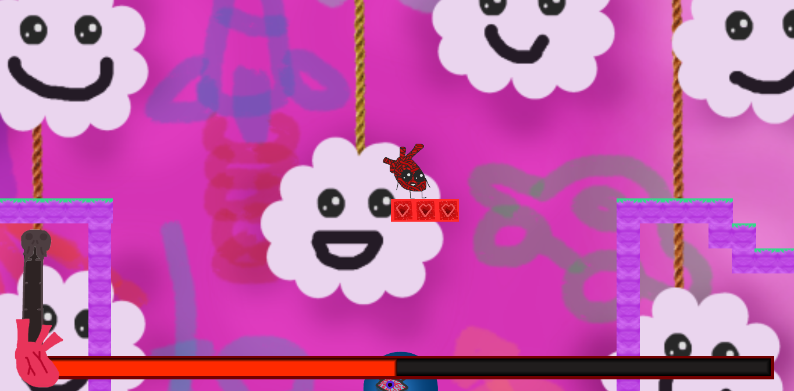

# HeartBeat
 
Made in Godot!

  

 

[Github of the Artist!](https://github.com/GreygorArchmoon)

[Play it here!](https://gotm.io/emilysalum/heart-beat)
  

Made for this [Game Jam!](https://itch.io/jam/game-jaaj-6)

## State
-- Completed, although a few features had to be forgotten. You know, scoping things badly --

